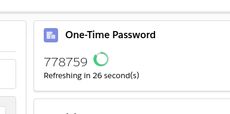
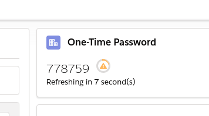

# LWC OTP

[Deploy to Salesforce](https://githubsfdeploy.herokuapp.com/app/githubdeploy/Dogeforce/lwc-otp)

This component adds an OTP generator in a record page of your choice. Assuming the secret is stored in a field, that is.

Library used to calculate the code is the [jsOTP](https://github.com/jiangts/JS-OTP/).

## Screenshots

### When there's plenty of seconds to copy and paste the code elsewhere

### When time is running out

## API

|Attribute|Description|
|--|--|
|Title|Title to be displayed|
|Icon name|Icon name according to the Lightning Design System naming convention.|
|Field API Name|API name of the field in the current record that stores the OTP secret.|

## Limitations

At this moment there is no option to use codes that differ from the standard 30 second SHA1 6-digit defaults.
